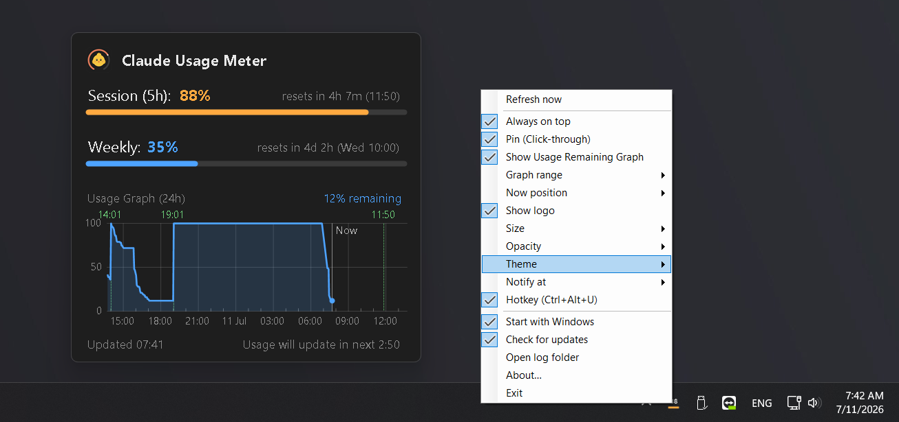

# Claude Usage Meter for Windows


[](LICENSE)
[](../../releases/latest)

A tiny Windows system-tray app that shows your **Claude usage limits** in real time —
the same *Session (5h) / Weekly / per-model weekly* percentages you see in
Claude Code's `/usage`, always one click away.



## Features

- 🟦 **Tray icon** with the highest usage % drawn live, color-coded (blue → orange → red)
- 🖱 **Left-click** opens a dark popup with a progress bar, reset countdown and actual reset time per limit window
- 📌 **Always on top** — pin the popup anywhere on screen (drag to move, position remembered)
- 👻 **Pin (Click-through)** — pinned popup lets mouse clicks pass through to windows behind it
- 📈 **Usage Remaining graph** — session remaining % over the last 24 h with an hourly time axis (toggleable)
- 🔍 **3 sizes** (Small / Medium / Big) and **5 opacity levels** (hover restores full opacity)
- 🔔 **Usage alert** — Windows notification at a threshold you pick (50–95 %, or off)
- ⏱ Live countdown to the next data refresh
- 🚀 Starts with Windows (toggleable), single instance, ~200 KB framework-dependent build
- 💾 All preferences persist across restarts

## Download

Grab `ClaudeMeter-portable.zip` from the **[latest Release](../../releases/latest)** —
a single self-contained exe, no .NET installation required.

> Windows SmartScreen may warn because the exe is not code-signed:
> click **More info → Run anyway**.

## Requirements

- Windows 10/11 (64-bit)
- [Claude Code](https://claude.com/claude-code) CLI logged in once with your Claude account:

  ```
  claude
  /login
  ```

  The app reads the OAuth token that Claude Code stores on your machine
  (`%USERPROFILE%\.claude\.credentials.json`) — it never sees your password and
  **never modifies** Claude Code's files.

## Usage

| Action | Result |
|---|---|
| Left-click tray icon | Show/hide the usage popup |
| Right-click tray icon | Refresh now · Always on top · Pin (Click-through) · Show Usage Remaining Graph · Show logo · Size ▸ · Opacity ▸ · Notify at ▸ · Start with Windows · About… · Exit |
| Drag (while pinned) | Move the popup anywhere; position is remembered |
| Esc | Hide the popup |

Data refreshes every **3 minutes** — Anthropic's usage endpoint rate-limits
anything faster.

## Build from source

Requires the .NET 8 SDK.

```powershell
dotnet run                                                  # develop
dotnet publish -c Release -r win-x64 --self-contained false `
  /p:PublishSingleFile=true -o publish                      # ~200 KB (needs .NET 8 runtime)
dotnet publish -c Release -r win-x64 --self-contained true `
  /p:PublishSingleFile=true /p:EnableCompressionInSingleFile=true `
  /p:IncludeNativeLibrariesForSelfExtract=true /p:DebugType=none `
  -o portable                                               # ~68 MB portable exe
```

## How it works

The app calls Anthropic's OAuth usage endpoint
(`https://api.anthropic.com/api/oauth/usage`) with the token from your local
Claude Code login — the same source that powers `/usage`. Usage windows are
parsed dynamically, so new limit types added by Anthropic appear automatically.
If the token expires, it is refreshed **in-memory only** and cached under
`%APPDATA%\ClaudeMeter\` — Claude Code's credentials file is treated as read-only.

**Privacy:** no telemetry, no third-party servers. The only network calls are to
Anthropic's own API. Settings and history live in `%APPDATA%\ClaudeMeter\`.

**Troubleshooting:** the app writes small daily logs (activity + errors, never
tokens) to `%APPDATA%\ClaudeMeter\logs` — tray menu → **Open log folder**.
Logs older than 7 days are deleted automatically. Attach the latest log when
reporting an issue.

## Disclaimer

This is an unofficial hobby project, not affiliated with Anthropic.
The usage endpoint is undocumented and may change or stop working at any time.

## License

[MIT](LICENSE)
