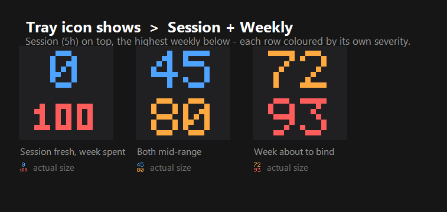
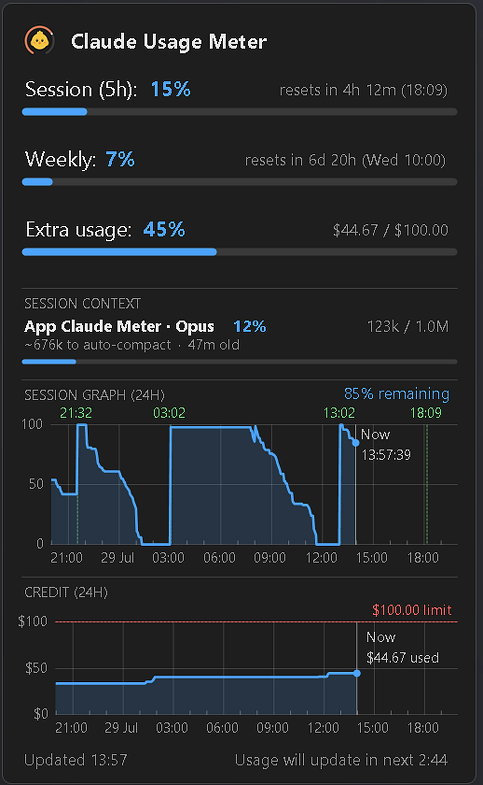
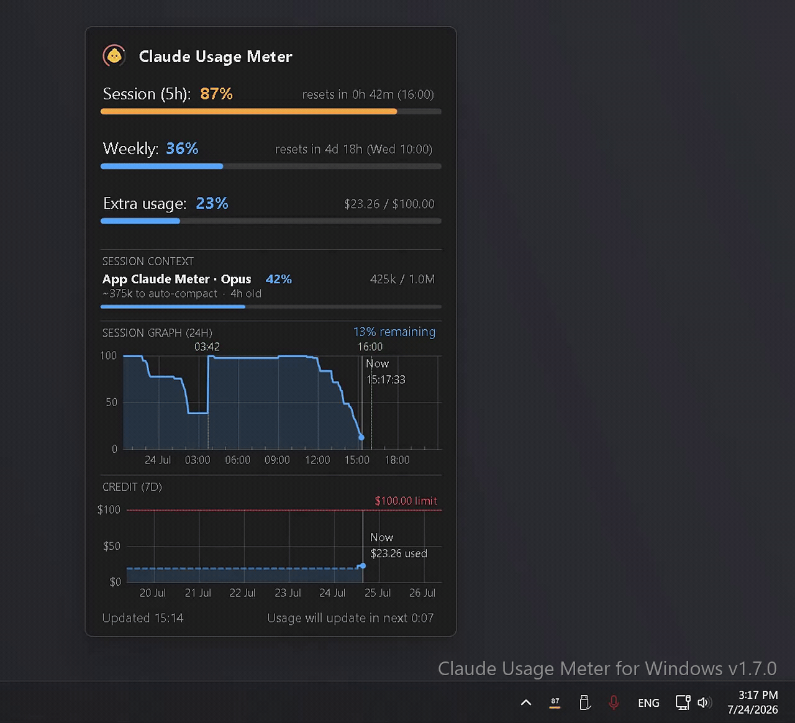
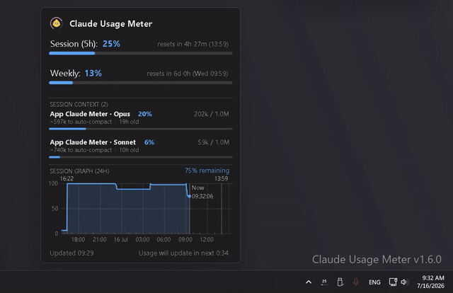
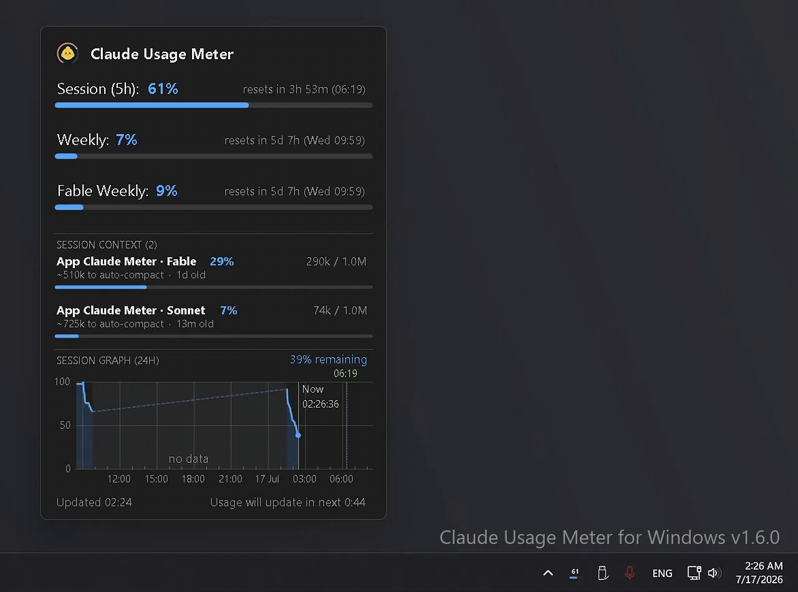

# Claude Usage Meter for Windows


[](https://github.com/SKGoC-CLI/claude-meter-for-windows/actions)


[](LICENSE)
[](../../releases/latest)

A tiny Windows system-tray app that shows your **Claude usage limits** in real time —
the same *Session (5h) / Weekly / per-model weekly* percentages you see in
Claude Code's `/usage`, always one click away.

*New in v1.8.0 — the tray icon can show both limits at once, Session (5h) stacked over Weekly, so a draining week can't hide behind a fresh session:*

<p align="center">
  
</p>

*Every limit, every session's context window, and both graphs — one click from the tray:*

<p align="center">
  
</p>

*Track your usage credits in real dollars against the monthly cap — a live spending graph with the limit line marked, and a matching dollar row up top:*



*Every active Claude Code session's context window at a glance, with live token counts:*



*The usage graph is honest about downtime — "no data" bands instead of fabricated lines:*



## Features

- Tray icon renders your highest usage percentage live, shifting color as you approach the limit; the optional Session + Weekly mode stacks both limits so you catch a draining week at a glance
- Popup shows a progress bar, reset countdown and exact reset time for every limit window
- Usage credits displayed as real dollar amounts (e.g. "Extra usage: 6% — $3.13 / $50.00"), with the same data from `extra_usage` and `spend` rows merged into one
- Usage graph plots session remaining over a 12 or 24 hour axis, with hourly ticks, reset markers for both past and upcoming resets, and an adjustable "now" position
- Credit spending graph shows cumulative month-to-date usage-credit spend up to your monthly limit, with a dashed limit line and live "now" marker; stays accurate even if the meter isn't running (45-day history sampled every 30 minutes)
- Pin the popup anywhere on screen; optionally let mouse clicks pass through it while pinned
- Dark and light themes, three popup sizes, five opacity levels with full opacity restored on hover
- Usage alert notifications at any threshold from 50 to 95 percent, plus a credit-burn notification when usage credits start being consumed (at most once per 2 hours)
- One-click login recovery when the Claude session expires, plus local diagnostic logs for troubleshooting
- Global hotkey to toggle the popup — Ctrl+Alt+U by default, seven combos to pick from — plus autostart with Windows, automatic update check, single instance
- Every preference persists across restarts

## Download

Grab `ClaudeMeter-portable.zip` from the **[latest Release](../../releases/latest)** —
a single self-contained exe, no .NET installation required.

> Windows SmartScreen may warn because the exe is not code-signed:
> click **More info → Run anyway**.

## Requirements

- Windows 10/11 (64-bit)
- A Claude login already on this machine — **either one** works:
  - the **Claude Desktop app**, signed in — nothing else to set up, or
  - the **[Claude Code](https://claude.com/claude-code) CLI**, logged in once:

    ```
    claude
    /login
    ```

  The app reads the OAuth token your Claude login already stores locally —
  it never sees your password and **never modifies** those files.

## Usage

| Action | Result |
|---|---|
| Left-click tray icon | Show/hide the usage popup |
| Right-click tray icon | Everything else — refresh, popup sections (Show limits / Session context / Session graph / Credit graph / Appearance), pinning, tray & alert options, hotkey, autostart |
| Drag (while pinned) | Move the popup anywhere; position is remembered |
| Esc | Hide the popup |

Data refreshes every **3 minutes** — Anthropic's usage endpoint rate-limits
anything faster.

## Build from source

Requires the .NET 8 SDK.

```powershell
dotnet run                                                  # develop
dotnet publish -c Release -r win-x64 --self-contained false `
  /p:PublishSingleFile=true -o publish                      # ~200 KB (needs .NET 8 runtime)
dotnet publish -c Release -r win-x64 --self-contained true `
  /p:PublishSingleFile=true /p:EnableCompressionInSingleFile=true `
  /p:IncludeNativeLibrariesForSelfExtract=true /p:DebugType=none `
  -o portable                                               # ~68 MB portable exe
```

## How it works

The app calls Anthropic's OAuth usage endpoint
(`https://api.anthropic.com/api/oauth/usage`) with the token from your local
Claude login — the same source that powers `/usage`. It reads whichever login is
fresh: the Claude Code CLI's credentials file, or the Claude Desktop app's own
token cache (so it stays live even if you only ever use Desktop's Code tab and
never open a terminal). Usage windows are parsed dynamically, so new limit types
added by Anthropic appear automatically.

Every login source is treated as strictly read-only — the app never refreshes or
rotates a token, so it can't disrupt Claude Code's or Desktop's own session. When
every source has gone stale, the meter shows your last-known usage as stale and
updates again automatically the next time you use Claude.

**Privacy:** no telemetry, no third-party servers. The only network calls are to
Anthropic's own API. Settings and history live in `%APPDATA%\ClaudeMeter\`.

**Troubleshooting:** the app writes small daily logs (activity + errors, never
tokens) to `%APPDATA%\ClaudeMeter\logs` — tray menu → **Open log folder**.
Logs older than 7 days are deleted automatically. Attach the latest log when
reporting an issue.

## Disclaimer

This is an unofficial hobby project, not affiliated with Anthropic.
The usage endpoint is undocumented and may change or stop working at any time.

## License

[MIT](LICENSE)
